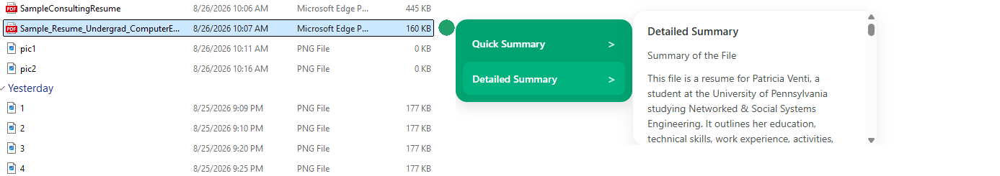

# FilePeek

### Understand a file before you open it.

FilePeek is a Windows file intelligence tool built with C++ that brings AI-powered file understanding directly into the File Explorer workflow.

Instead of opening an unfamiliar file, copying its contents, switching to an LLM, pasting the content, and asking what the file is about, FilePeek lets you begin understanding the file directly from File Explorer.

Hover over a file, move to the FilePeek indicator, and choose between a Quick Summary or Detailed Summary.

FilePeek uses NVIDIA Nemotron for AI-powered file understanding.

---

## Demo


FilePeek detects the file being hovered over and places a small indicator beside it. Hovering over the indicator reveals the Quick Summary and Detailed Summary options.

### Quick Summary


Quick Summary is designed to answer the first question you usually have when looking through unfamiliar or poorly named files:

**What is this file?**

Rather than giving a long generic summary, it aims to provide enough context to identify the document at a glance.


The goal is to help determine whether a file is the one you are looking for without opening and reading through it first.

### Detailed Summary



Detailed Summary provides a more complete explanation when you want to understand the contents of a file before opening it.

---

## Why I Built FilePeek

My file manager is often full of files with names that tell me very little about what is actually inside them.

Finding the right document can turn into opening several files one by one just to figure out what each one contains.

There was another workflow I noticed in myself.

When a document looked overwhelming to read, I would sometimes open it, copy its contents, switch to an LLM, paste everything there, and ask questions such as:

- What is this document about?
- What am I supposed to do?
- Can you summarize this?
- Is this the file I am looking for?

I also conducted a small informal survey with people around me and asked about this behavior. Several people described doing something similar when a document felt overwhelming or when they wanted to understand it quickly.

That made me think about the number of steps involved.

```text
Find file
   |
   v
Open file
   |
   v
Read or copy content
   |
   v
Open an LLM
   |
   v
Paste content
   |
   v
Ask what the file contains
```

What if some of that understanding could begin where the problem starts?

**Inside the file manager itself.**

FilePeek explores that idea by bringing lightweight AI-powered file understanding into the normal file-browsing workflow.

I also built FilePeek as a way to strengthen my C++ skills through a project that required more than implementing isolated algorithms. Building it gave me experience working with Windows APIs, filesystem interaction, native UI behavior, processes, asynchronous execution, caching, performance profiling, WebView2, and communication between C++ and a packaged AI backend.

---

## How FilePeek Works

FilePeek runs alongside Windows File Explorer and monitors which file the user is interacting with.

```text
Windows File Explorer
        |
        v
Hovered File Detection
        |
        v
FilePeek Trigger
        |
        +----------------------+
        |                      |
        v                      v
 Quick Summary          Detailed Summary
        |                      |
        +----------+-----------+
                   |
                   v
          FilePeekBackend.exe
                   |
                   v
            File Extraction
                   |
                   v
           NVIDIA Nemotron
                   |
                   v
             Summary Result
                   |
                   v
           FilePeek Interface
```

The C++ application handles Explorer interaction, hover detection, the FilePeek interface, caching, asynchronous requests, and communication with the backend.

The backend extracts information from the selected file and communicates with NVIDIA Nemotron to generate the requested summary.

---

## Features

- File Explorer hover detection
- Quick file identification
- Detailed file summaries
- NVIDIA Nemotron integration
- Document text extraction
- Image understanding
- Summary caching
- File-change-aware cache keys
- Asynchronous summary processing
- Adaptive Explorer polling
- WebView2-powered summary interface
- Packaged Windows backend
- Portable v1.0.0 release
- No need to manually copy file contents into an LLM just to identify a document

---

## Quick Summary vs Detailed Summary

### Quick Summary

Quick Summary is optimized for **identification**.

It attempts to provide a concise description that can be understood at first glance.

It is useful when browsing many files and asking:

> Is this the file I need?

### Detailed Summary

Detailed Summary is intended for **understanding**.

It provides additional information about the file when the Quick Summary indicates that the document may be relevant.

This creates two levels of interaction:

```text
Need to identify the file?
        |
        v
   Quick Summary
        |
        v
Need more context?
        |
        v
 Detailed Summary
```

---

## Performance and Optimization

Building the first working version of FilePeek was only part of the project. I also profiled the application to understand where time and CPU resources were being spent.

### Measuring the Summary Pipeline

I added performance instrumentation around different stages of the summary request.

Example debug output:

```text
[FilePeek Performance] quick request dispatch: 0 ms
[FilePeek Performance] quick backend: 12656 ms
```

This helped separate FilePeek's native request handling from the more expensive backend processing.

The measurements showed that C++ request dispatch was effectively immediate, while most of the waiting time came from backend extraction and model inference.

### Quick Summary Latency

I measured three cold Quick Summary requests before and after optimization.

| Run | Before | After |
| --- | ---: | ---: |
| 1 | 12,656 ms | 9,703 ms |
| 2 | 12,422 ms | 8,547 ms |
| 3 | 13,687 ms | 9,422 ms |
| **Average** | **12,922 ms** | **9,224 ms** |

Average cold Quick Summary latency decreased from approximately:

**12.92 seconds → 9.22 seconds**

This represents approximately a **28.6% reduction in latency** in these test runs.

The optimization focused on reducing unnecessary work for Quick Summary requests and limiting processing to the information required to identify a file.

### Summary Caching

Generating the same summary repeatedly would waste both time and model requests.

FilePeek therefore creates a cache key using:

- File path
- File modification time
- Summary mode

Conceptually:

```text
file path
   +
last modification time
   +
summary mode
   |
   v
cache key
```

If the same unchanged file is requested again, FilePeek can reuse the cached result.

During debugging, cached requests produced measurements such as:

```text
[FilePeek Performance] quick cache hit: 0 ms
```

This measurement represents the application-side cache lookup and retrieval time, rather than a new model inference request.

If the file is modified, its modification timestamp changes, producing a different cache key and allowing FilePeek to request a fresh summary.

### Asynchronous Processing

AI requests should not freeze the FilePeek interface.

Summary processing therefore runs on a background thread.

The UI can display a loading state while the backend processes the file, and the result is returned to the main application when processing finishes.

This keeps the native interaction responsive even when model inference takes several seconds.

### Adaptive Polling

FilePeek needs to detect which Explorer item the user is hovering over, but checking Explorer continuously at maximum frequency would waste CPU resources.

The polling interval therefore changes depending on activity.

When the user is actively interacting with FilePeek, polling becomes faster to maintain responsive hover behavior.

When FilePeek is idle, polling slows down.

During testing, idle CPU usage decreased from approximately **0.2 to 0.4%** to around **0.0 to 0.1%**, while the hover interaction remained responsive.

---

## Architecture

FilePeek combines native Windows functionality with an AI processing backend.

### C++ Application

The C++ side is responsible for:

- Windows File Explorer interaction
- Detecting hovered Explorer items
- Positioning the FilePeek trigger
- Managing the summary interface
- WebView2 integration
- Cache management
- File-change detection for cached summaries
- Asynchronous request handling
- Launching the packaged backend
- Receiving backend output
- Performance instrumentation

### Backend

The backend is responsible for:

- File extraction
- Preparing file content for summarization
- Handling supported document and image inputs
- Communicating with NVIDIA Nemotron
- Quick Summary generation
- Detailed Summary generation

For the packaged release, the Python backend is bundled into:

```text
FilePeekBackend.exe
```

This allows the C++ application to launch the backend directly without requiring the user to manually run the Python scripts.

---

## Download

### FilePeek v1.0.0

The first packaged release of FilePeek is available through GitHub Releases.

[Download FilePeek from Releases](https://github.com/wagueacarinetech-hue/File-Peek/releases)

Download:

```text
FilePeek-v1.0.0.zip
```

---

## Installation

### 1. Download the Release

Go to the FilePeek Releases page:

```text
https://github.com/wagueacarinetech-hue/File-Peek/releases
```

Download:

```text
FilePeek-v1.0.0.zip
```

### 2. Extract the ZIP

Extract the downloaded ZIP somewhere on your Windows computer.

The release folder contains the FilePeek application and the components it needs to run.

For example:

```text
FilePeek-v1.0.0/
├── FilePeek.exe
├── FilePeekBackend.exe
└── WebView2Loader.dll
```

Keep these files together in the same folder.

### 3. Configure NVIDIA API Access

FilePeek uses NVIDIA Nemotron for AI-powered summarization.

You will need an NVIDIA API key.

Set an environment variable called:

```text
NVIDIA_API_KEY
```

In PowerShell:

```powershell
setx NVIDIA_API_KEY "YOUR_API_KEY_HERE"
```

Replace:

```text
YOUR_API_KEY_HERE
```

with your own NVIDIA API key.

After setting the environment variable, start a new terminal session or restart FilePeek so the new variable is available.

> Never place your API key directly in the source code or commit it to GitHub.

### 4. Run FilePeek

Launch:

```text
FilePeek.exe
```

Then open Windows File Explorer.

---

## Using FilePeek

Once FilePeek is running:

1. Open Windows File Explorer.
2. Hover over a file.
3. A small green FilePeek indicator appears beside the file.
4. Move the cursor over the indicator.
5. Choose **Quick Summary** or **Detailed Summary**.
6. Hover over the desired option.
7. FilePeek processes the file and displays the result.

Quick Summary is useful for identifying the file quickly.

Detailed Summary is useful when you want additional context.

---

## Caching Behavior

FilePeek currently maintains summaries in application memory.

If a summary has already been generated for an unchanged file during the current session, FilePeek can return that result without making another model request.

Changing the file causes the modification timestamp used by the cache key to change.

This prevents an old cached summary from automatically being treated as the summary for a newly modified version of the file.

---

## Project Structure

```text
File-Peek/
│
├── FilePeek/
│   ├── FilePeekUI.cpp
│   ├── ExplorerDetector.cpp
│   ├── ExplorerDetector.h
│   ├── backend.py
│   ├── extractor.py
│   ├── summarizer.py
│   └── ...
│
├── docs/
│   └── images/
│       ├── filepeek-overview.png
│       ├── quick-summary.png
│       └── detailed-summary.png
│
├── .gitignore
├── README.md
└── ...
```

---

## Technology

FilePeek currently uses:

| Technology | Purpose |
| --- | --- |
| **C++** | Core Windows application |
| **Windows API** | Native window and process interaction |
| **WebView2** | Summary interface |
| **Python** | Extraction and AI backend |
| **NVIDIA Nemotron** | AI-powered file understanding |
| **PyInstaller** | Packaging the Python backend |
| **Visual Studio** | C++ development and building |

---

## Privacy and API Usage

FilePeek works with files selected through the user's local Windows File Explorer workflow.

The application performs local extraction before sending the information required for AI summarization to the configured NVIDIA model API.

Users should avoid processing sensitive or confidential files unless they are comfortable with the data-handling policies of the AI service being used.

API credentials should be supplied through environment variables and should never be committed to the repository.

---

## Building From Source

Clone the repository:

```bash
git clone https://github.com/wagueacarinetech-hue/File-Peek.git
cd File-Peek
```

Open the Visual Studio solution and build the FilePeek C++ project.

When developing the backend directly rather than using the packaged executable, the required Python dependencies must also be installed.

The packaged release is recommended for normal use.

---

## Current Status

### v1.0.0

FilePeek v1.0.0 is the first packaged release demonstrating the project's core workflow:

**File understanding directly from Windows File Explorer.**

The current release includes the working Explorer interaction, Quick Summary, Detailed Summary, AI backend, caching, asynchronous processing, performance optimizations, and portable application packaging.

FilePeek remains an experimental project and there are several areas I would like to continue improving.

---

## Future Improvements

Some areas I would like to explore next include:

- Custom FilePeek branding and hover icon
- Faster cold summary generation
- Persistent caching between application sessions
- Additional file formats
- Better handling of very large documents
- Additional summary modes
- Improved image understanding
- Model configuration options
- Automatic startup with Windows
- Installer-based distribution
- Reduced runtime dependencies
- Improved error handling
- Deeper native Windows integration

---

## What I Learned

FilePeek started as a way to practice C++, but it grew into a project that required thinking about much more than syntax.

I worked with:

- Native Windows programming
- Explorer interaction
- Window positioning
- COM-related Windows functionality
- WebView2
- C++ and Python interoperability
- Process creation and communication
- Multithreading
- Caching
- File metadata
- Performance profiling
- CPU optimization
- API integration
- Backend packaging
- Application distribution

One of the biggest lessons from the project was that getting a feature to work and getting it to feel responsive are different problems.

Profiling FilePeek made it possible to identify where latency actually came from rather than guessing, and that information guided the later optimization work.

---

## The Idea Behind FilePeek

AI has made it easy to understand large amounts of information, but using it often requires moving information away from the place where we encountered it.

For documents, that can mean:

```text
File Explorer
     |
     v
Open document
     |
     v
Copy content
     |
     v
Switch applications
     |
     v
Paste into LLM
     |
     v
Ask for explanation
```

FilePeek asks whether part of that interaction can be shortened to:

```text
File Explorer
     |
     v
Hover file
     |
     v
Understand file
```

The goal is not to replace opening or reading documents.

It is to provide enough context at the moment of browsing to help users decide **what a file is, whether it is relevant, and whether they need to open it at all.**

---

## Author

Built by **Waguea Carine Fongang** as a project exploring C++, Windows development, AI integration, and a faster way to understand local files.

---

## License

See the repository license for usage and distribution terms.
